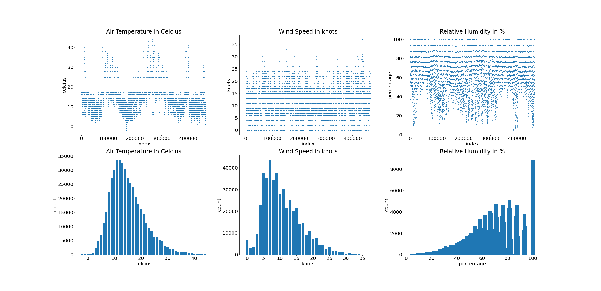
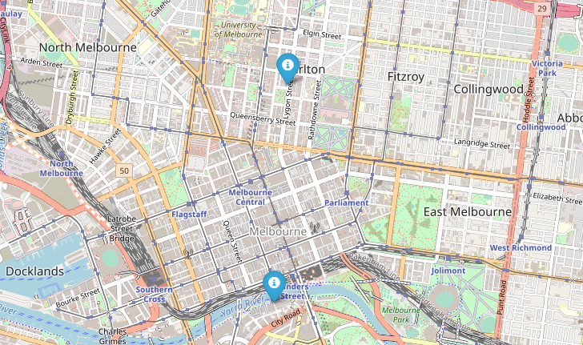
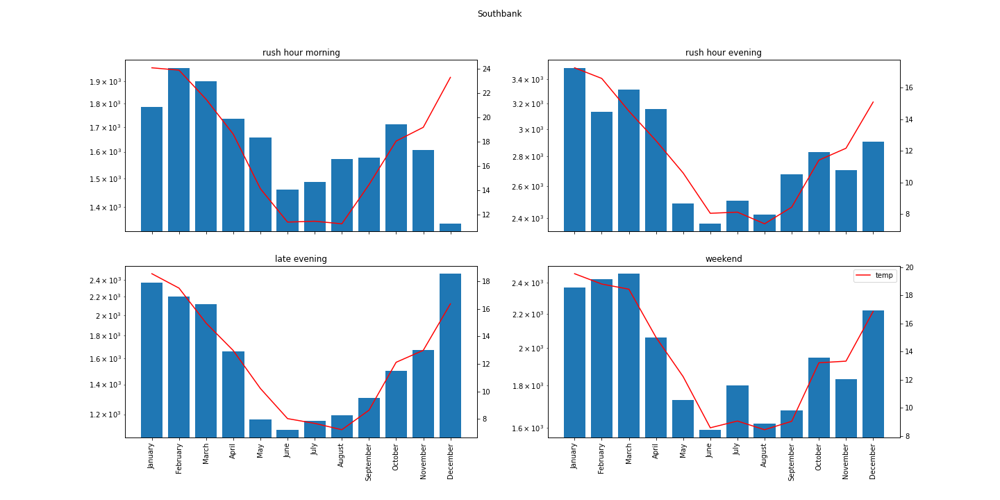
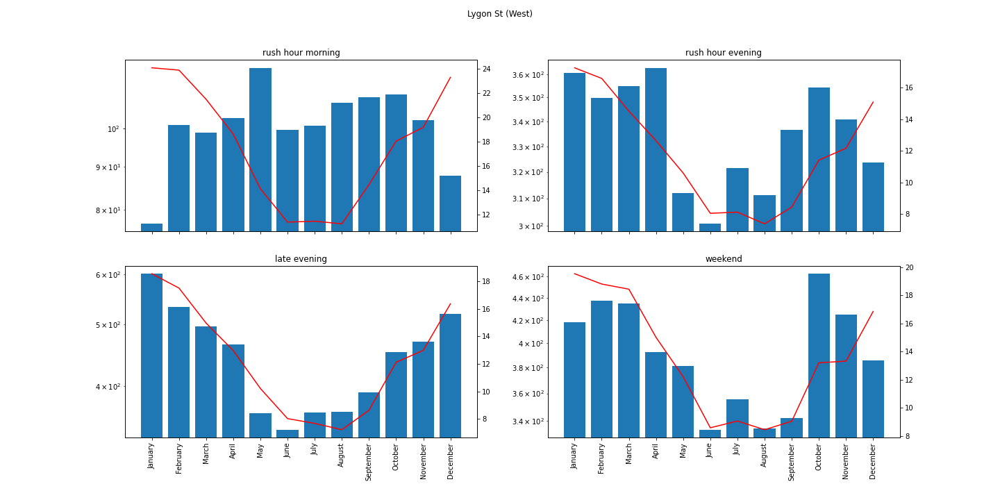
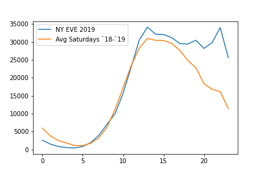
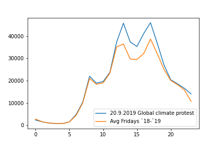
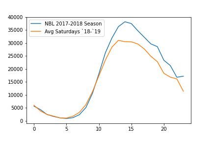

# Exploratory Data Analysis:

### Pedestrian volumes over the week:

A study of the pedestrian volumes over the week for different times of the day revealed that the volumes were more or less consistent for the different times of the day during weekends and weekdays except for day time. The day time volumes were almost halved indicating closed offices. An interesting pattern is also noted on Fridays: the volumes are similar from early morning through evening to those from Monday-Thursday. However, the late night volumes are almost twice as that of the other weekdays, which indicates that the area has a good night life. 

### Pedestrian volumes by hour of day:

As we explored the volumes based on the time of day across sensors we observed an overall shift of distribution towards the late hours on Fridays compared to Monday-Thursdays as weekend vibe sets in. Sensors could be picking up pedestrian activity generated for restaurant/club goers. Some sensors such as Bourke Street have moderate to high sensor volumes throughout the day; Lygon street shows high activity during the Friday late evenings whereas there are others that have high volumes during start of the business hours.

We then created interactive visualizations to view the average pedestrian volumes by the hour based on the user's choice of a sensor and day of week. It helped us validate our observations from the boxplot. Further, it also pointed out which hour is the busiest or least busy in the day for each sensor, an information that isn't available through the Box plots. For example, the Bourke street sensors indeed show a drop in activity between 1pm-4pm , which then later picks up in the evening. Also, Princes Bridge and Southbank ( the names suggest proximity to a water body) pick up exceptionally high volumes around 5 pm which could also be driven by tourists.  

### Weather
Imagine being in Melbourne right now, how do you think the weather would be right now? And would that somehow influence the local peoples social behaviour ? Would it be possible to predict how many people are walking on the streets based on day time and weather?  Those are some of the questions we asked ourselves, because you see in the Nordic countries people are very influenced by the weather, a cold and rainy is better spend idoors with a nice cop of coffe and a good book.   

Therefore we inspected the weather in Melbourne for the period 2018-2019, and compared it with the Pedestrian data of Melbourne. 
The weather variables that we had acces to which are easy to understand are Temperature, relative Humidity and Windspeed, thus lets take a close look on these 

The plot shows us that the temperature is dependant on the season, whereas relative humidity and wind speed has no seasonal pattern 
Air temperature follows a skew normal distribution. The same holds for Windspeed even though it is not as clear as for the temperature.   
However relative humidity does not follow a noral distribution since many observations show a relative humidity around 100% . 

### Weather and social behaviour

We looked at the relation between weather and pedestrian flow, and found two very interesting sensors mirroring social behaviour based on weather, so let's dive into that. The two sensors we are going to look at are *Southbank* and *Lygon St (West)*, the location of the two are shown below

We decided to look at the pedestrian flow between the hours 6 and 22 as this is were most people are on the streets. 

The plot below shows pedestrian counts for the sensor at southbank for four selected timeslots alongside the mean temperatures. There is clearly a positive corelation, meaning that there are more pedestrians when the temperatures are higher. This patterns are more profount in the mornings and late evening, whereas the coreation is more noisy in weekends and evening rush hours. One could hypothesice that decision regarding the mean of transportation to and from work for those who have the choice, is made in the mornings. In the afternoon, you are stuck with or without the car you took in the morning. In the evening once again you are free to go out, if the weather is attractive. For the weekends the months of July and November are deviating from the general picture, in opposite directions, that coule be worth looking further into. In July some activities, which do not take place during the other summer months, seem to be attrcting people to the streets on weekends. Melbourners might be instantly aware, what this is, but as data travellers, we can only conclude that we have stumpled across something we can't explain, and would like to look further into, possibly by including other sources of data. 

In Lygon st. (west) the patterns are wery different for different times, during the week. In morning rush hurs we see a tendency, similar to that of Southback, where higher temperatures coinside with higher numbers of pedestrians. This pattern is also to some extent pesent fo the evening rush hours as well as for the weekend, but this pattern is only distinguashable because there are visibly fewer pedestrians in the winter season - is does not old for comparing two summer months to each other. Perhaps most curously, the morning volumes seem to follow a completely different logic. The pedestrian volumes passing the sensor at Lygon st (west) in the mornings  maintain similar levels through the months February-November. However, in december and January, the levels drops very visibly. A tendency wich does not exist for the other time slot, nor can it be explained by the temperatures. 

# Event Based Analysis

### Motivation:

The event based visualization is an effort towards understanding the pulse of the city of Melbourne. The Central Business District being an important area for socio cultural as well as business activity , would naturally be an ideal location for people to gather and express joy as they celebrate a win or usher in the new year. As a normal corollary, crowds would be expected to gather and demonstrations be called for to express their resentment towards a socio-political event, be it local or global.

A set of different events were chosen and the pedestrian traffic captures by the sensors on those days were plotted on a leaflet map. The visualization combines the volume based circle markers with an image and headline overlay relevant to the event.

### Technical Overview:

Ipyleaflets along with Ipywidgets were used for this interactive visualization. Actual pedestrian volumes were plotted for the sensors based on their Latitude and Longitude information. Dropdowns were introduced to let the user pick the time of day and the event. Related images of the event and a newspaper headline related to the same were overlayed on the plot for a more intuitive experience of the reader

## A few data stories:

Following are a few events that told a story of their own via the sensors:

### Annual Event: New Years 2019

The sensors witnessed a shift in pedestrian volumes during the New Year celebrations at CBD. The average pedestrian volumes were comparatively higher than those witnessed on regular days.

The above plot shows a comparison between the total pedestrian traffic by the hour on a regular Saturday, compared to the New Years eve which was a Saturday too. The pedestrian volumes are seen to rise during the late hours as people of Melbourne usher in the new year.

### Social Event: Global Climate Action day

We noticed a rise in the day time volumes until early evening on the day of 20-Sep-2019 a day when protesters hit the streets to demonstrate against global climate change. The crowds may have dispersed by the evening which is when we see the pedestrian volumes going back to normal levels.

### Sporting Event: Melbourne defeats Adelaide to win the NBL Season

A rise in the pedestrian volumes was observed as compared to regular Saturdays during the evening hours on 31-Mar-2018 when Melbourne defeated Adelaide to clinch the NBL season. This could be attributed to the crowds coming out to watch the match together with their friends at the pubs or to rejoice the victory over mugs of beer

### Synopsis:

The above stories give us an insight into the lives of people in Melbourne and triggers our imagination of how life is the city is. From our exploration of the data, an average office going "Melbourne-er" working at CBD would take the subway to work at around 8-9 am ( which probably explains the high volumes observed at some of the sensors). She would probably step out for a coffee break during to mid day or early afternoon and take short walk on the Bourke Street. Once she is done with the day's work, she is likely to catch up with her colleagues or friends for an informal chat during the evening at the restaurants and clubs(evening volumes in the sensors on weekdays and comparatively higher on Fridays) in that area before heading home. She may want to spend a longer time unwinding on Fridays as the weekend is here. Occasionally, she may witness a rally walking down the road during the day time(based on the pedestrian behavior during demonstrations) or hear a loud cheer coming from the nearby pubs in the evenings when the favorite sporting team brings the trophy home. 

## 2020 - Influence of the Pandemic

In 2020 Melbourners had to live through, what have been termed one of the worlds most strict lockdown. So let's explore what happens when the most liveable city finds itself under one of the worlds hardest lockdowns. We have done some exploration, and build an interactive setup that allows you to explore further.  

Lockdowns are messy, there is no simple 'is' or 'is not' label you can put on a city on a given date, nor is there a well defined scale for stages of lockdown, as restrictions can be (and have been) combined in numerous ways. Even within the same city, some parts of the lockdowns taking place have been geographically differentiated. Furthermore, in a city, that usually attracts large amounts of tourists, pedestrian levels can be assumed not just to be influenced by local lockdowns, but also travelling restrictions from abroad, or from other parts of the country. Thus, instead of defining one lockdown period or creating a scale, we consider 2020 a 'special year', and study the temporal and spacial patterns, bearing in mind that especially from march-may and july-october, there were particularly strict regulations. However we also study patterns of 'recovery' and 'pauses' in the lockdown, seeing that especially december were close to 'corona free'.Still it is possible to pick days and weeks in which it can't be argued, that a strict lockdown were in place, and study pedestrian patterns during this time, compared to the same time the years before.  

#### Temporal patterns

2020 was not 'just covid'. In the first two month, WHO had not yet decared the global pandemic, and most cities around the world were not really affected. Also reaching December, Melbourne and all of the state of Victoria was 'corona free' for the majority of the month. Regulations shift constantly in an attempt to do what is necessary, but not more that that. 

Though every city have their individual heartbeat, the heartneats ahare many similarities. On weekdays we work. On Friday and Saturday, we are more likely to go out at night. On weekdays leisure activities dominate. Thus, the way the pandemic influence these speres of life, can be expected to be reflected in out data. 

So what does the weekly and monthly pedestrian volumes tell us?

The left plot shows the accumulated monthly counts of pedestrians over melbourne for the years 2018-2020. Notice, that where there were fewer pedestrians in january and feruary 2019 than the year before, the trend shifted, and february 2020 were the 10th consecutive month, where pedestrian volumes were higher that the same month the year before. Pedestrian volumes in Melbourne were on an upward trend when covid19 hit. 

The green bars representing 2020 clearly shows the two waves of covid in Melbourne. In april the pedestrian volumes ht a minimum, then restrictions were lifted a little, and in may and june, we see some recovery, before the second wawe hits, and volumes dips even lower, for a longer duration this time. Towards the end of the year though, volumes are clearly rising again. However, we dont see a full return to pre-corona levels, even though december 2020 epidemiologically was 'corona free' untill 30th of december (having epidemiologically eliminated the virus by the end of november with 28 consecutive days with 0 new cases, and 0 deaths and 0 active cases, which lasted untill 30th of December).  

The plot to the right show the weekly patterns. It is clear that the most busy day is Friday, and the least busy is Sunday, and that this tendency has been somewhat 'flattened' in 2020, though it still exist. In order to understand if this is only an effect of the two first month, we must further disaggregate the data, to reflect both weekly and montly variations. Furthermore it will be more informative to also be able to look at the data for specific sensor locations. 

### Spacial patterns

As we know from the data analysis the pedestrian volumes differ a lot between the sensors. So do the degree to which the volume has droped from 2018 to 2020. 

On the plot below, the pedestrian volume for each sensor is plotted for the years 2018-2019-2020 as a proportion of their volume in 2018. It is noticed that the volumes fpr 2020 varies between one third and two third of the volume from 2018. 

### Temporal and spacial patterns - 3 areas hit differently

The first of the three plots above is from Lydon in July, between the first two wawes. The patterns from 2018 and 2019 where volumens are highest on fridays and saturdays, indicates an active nghtlife. With sundays having higher volumes than weekdays also leisure activities. In July 2020 on the other hand, there is no difference between the weekdays.

The second plot, which is from Spencer St-Collins Station (South), shows a very different pattern. Here weekdays are much busier than weekends, indicating that this is a business district. This area is also the one where 2020 differs most from the previous year, indicating that the activities in this area were due to severe restictions (offices or other activities, that could be carried out remotely or were deemed non-essential). 

The final plot is from New Quay. Here pedestian volumes do not show a strong weekly pattern, and also the difference between 2020 and previous years is smaller. This indicated, that the majority of pedestrians passing this sensor are doing so, while engaged in everyday activities such as grossary shopping. 

Are you curious about other locations or months? Go explore in the interactive plot below



